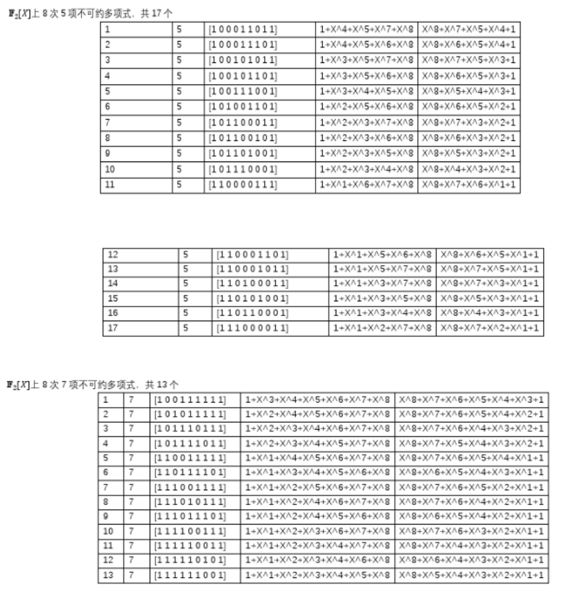

# 使用说明
## 不可约多项式
当前使用不可约多项式为：0x13F
$$
x^8 + x^5+x^4+x^3+x^2+x+1
$$

已测试多项式为:0x11b,0x11d,0x13f,0x17b

> 参考：https://wenku.baidu.com/view/59c3c573ba68a98271fe910ef12d2af90242a8e

## 文件目录结构
- tmp_file 文件夹为生成的测试文件，及存放测试文件经过五种模式加解密的文件
  - 生成文件为：i.dat
  - 加密文件为：i.dat.en
  - 解密文件为：i.dat.de
  - 测试秘钥为：key.dat
  - 测试iv为：iv.dat

- gtest 
  - googletest 单元测试文件

- pic README相关图片

## Linux下运行指令说明
> make

生成测试文件并运行

> make gen

重新生成测试文件

> make clean_gen

清空测试文件

> make test

对AES的加解密功能进行单元测试

> make clean

清除中间文件

# 时间测试

采用每个模式10个文件，每个文件19MB(500*40000字节)

| 名称 | 用时（O3） | 用时（O1） | 自己实现(列变换) |
| ---- | ---------- | ---------- | ---------------- |
| ECB  | 49171.9    | 75500      | 60312.5          |
| CBC  | 49015.6    | 74078.1    | 60156.2          |
| CFB  | 30625      | 30484.4    | 54328.1          |
| OFB  | 30625      | 30421.9    | 54343.8          |
| CTR  | 30531.2    | 30500      | 53250            |
| XTS  | 49671.9    | 74500      | 60937.5          |

值得注意的是，列变换和逆向列变换的实现细节并不相同，列变换具有针对性的改进。